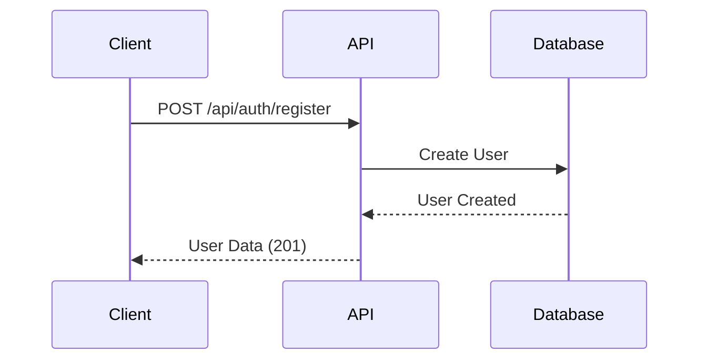
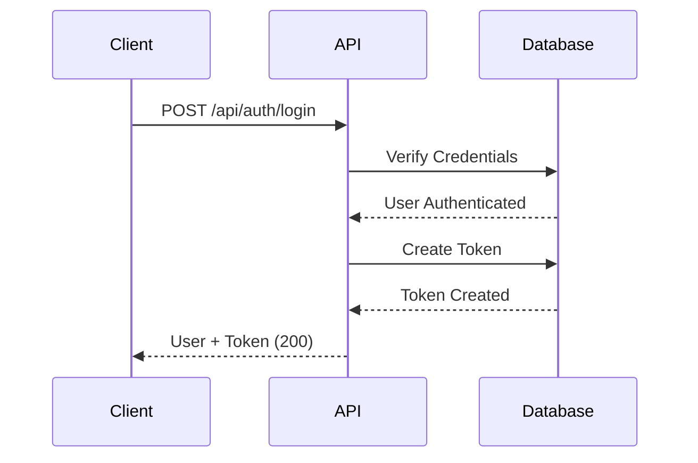
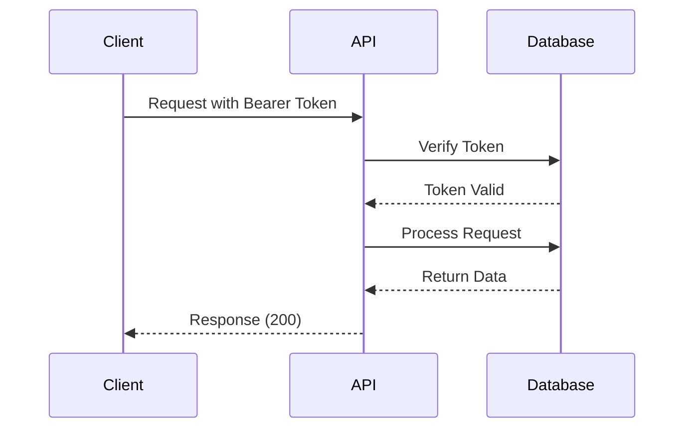

# Authentication Guide

## Overview

BukuBisnis API menggunakan Laravel Sanctum untuk token-based authentication. Sistem ini memungkinkan aplikasi frontend atau mobile untuk mengakses API dengan aman.

## Authentication Flow

### 1. Registration Process



### 2. Login Process



### 3. Protected Request Process



## Token Management

### Token Creation

Tokens dibuat saat login berhasil:

```json
{
    "message": "Login successful",
    "user": { ... },
    "token": "1|abc123def456...",
    "token_type": "Bearer"
}
```

### Token Usage

Sertakan token dalam header Authorization:

```
Authorization: Bearer 1|abc123def456...
```

### Token Expiration

-   Default: Tokens tidak memiliki expiration time
-   Untuk mengatur expiration, gunakan konfigurasi di `config/sanctum.php`
-   Tokens dapat di-revoke melalui endpoint logout

### Token Security

-   Simpan token dengan aman di client
-   Jangan expose token di URL atau logs
-   Gunakan HTTPS di production
-   Implement token refresh jika diperlukan

## Error Handling

### Authentication Errors

```json
{
    "message": "Invalid credentials",
    "errors": {
        "email": ["These credentials do not match our records."]
    }
}
```

### Authorization Errors

```json
{
    "message": "Unauthenticated."
}
```

### Token Validation Errors

```json
{
    "message": "Invalid token or token expired"
}
```

## Best Practices

### Client Implementation

1. **Store tokens securely** (iOS Keychain, Android Keystore, secure storage)
2. **Handle token expiration** gracefully
3. **Clear tokens on logout**
4. **Implement automatic logout** on 401 responses

### Server Security

1. **Use HTTPS** dalam production
2. **Implement rate limiting** untuk login attempts
3. **Log authentication events** untuk monitoring
4. **Regular token cleanup** untuk menghapus expired tokens

### Sample Implementation (JavaScript)

```javascript
class ApiClient {
    constructor(baseURL) {
        this.baseURL = baseURL;
        this.token = localStorage.getItem("api_token");
    }

    async register(userData) {
        const response = await fetch(`${this.baseURL}/auth/register`, {
            method: "POST",
            headers: { "Content-Type": "application/json" },
            body: JSON.stringify(userData),
        });

        if (!response.ok) {
            throw new Error(await response.text());
        }

        return response.json();
    }

    async login(email, password) {
        const response = await fetch(`${this.baseURL}/auth/login`, {
            method: "POST",
            headers: { "Content-Type": "application/json" },
            body: JSON.stringify({ email, password }),
        });

        if (!response.ok) {
            throw new Error(await response.text());
        }

        const data = await response.json();
        this.token = data.token;
        localStorage.setItem("api_token", this.token);

        return data;
    }

    async logout() {
        const response = await fetch(`${this.baseURL}/auth/logout`, {
            method: "POST",
            headers: {
                Authorization: `Bearer ${this.token}`,
                "Content-Type": "application/json",
            },
        });

        this.token = null;
        localStorage.removeItem("api_token");

        return response.ok;
    }

    async request(endpoint, options = {}) {
        const config = {
            ...options,
            headers: {
                "Content-Type": "application/json",
                ...options.headers,
            },
        };

        if (this.token) {
            config.headers.Authorization = `Bearer ${this.token}`;
        }

        const response = await fetch(`${this.baseURL}${endpoint}`, config);

        if (response.status === 401) {
            this.token = null;
            localStorage.removeItem("api_token");
            throw new Error("Authentication required");
        }

        if (!response.ok) {
            throw new Error(await response.text());
        }

        return response.json();
    }
}

// Usage
const api = new ApiClient("http://localhost:8000/api");

// Register
try {
    const user = await api.register({
        name: "John Doe",
        email: "john@example.com",
        password: "password123",
        password_confirmation: "password123",
    });
    console.log("User registered:", user);
} catch (error) {
    console.error("Registration failed:", error);
}

// Login
try {
    const loginData = await api.login("john@example.com", "password123");
    console.log("Login successful:", loginData);
} catch (error) {
    console.error("Login failed:", error);
}

// Make authenticated request
try {
    const accounts = await api.request("/accounts");
    console.log("Accounts:", accounts);
} catch (error) {
    console.error("Request failed:", error);
}
```

## Troubleshooting

### Common Issues

**1. "Unauthenticated" error**

-   Periksa apakah token disertakan dalam header
-   Pastikan format header: `Authorization: Bearer {token}`
-   Verifikasi token masih valid (belum expired atau revoked)

**2. "Invalid credentials" error**

-   Periksa email dan password
-   Pastikan user sudah terdaftar
-   Cek apakah ada typo dalam credentials

**3. CORS issues**

-   Pastikan CORS dikonfigurasi dengan benar
-   Tambahkan domain client ke allowed origins
-   Periksa preflight OPTIONS requests

**4. Token tidak tersimpan**

-   Periksa storage mechanism di client
-   Pastikan tidak ada error saat menyimpan token
-   Verifikasi token format yang benar

### Debug Steps

1. **Check network requests** di browser dev tools
2. **Verify token format** - harus dimulai dengan angka dan pipe (|)
3. **Test dengan curl** untuk isolasi masalah client
4. **Check Laravel logs** untuk error details
5. **Verify database** - pastikan personal_access_tokens table ada

### API Testing Commands

```bash
# Test registration
curl -X POST http://localhost:8000/api/auth/register \
  -H "Content-Type: application/json" \
  -d '{
    "name": "Test User",
    "email": "test@example.com",
    "password": "password123",
    "password_confirmation": "password123"
  }'

# Test login
curl -X POST http://localhost:8000/api/auth/login \
  -H "Content-Type: application/json" \
  -d '{
    "email": "test@example.com",
    "password": "password123"
  }'

# Test protected endpoint
curl -X GET http://localhost:8000/api/auth/me \
  -H "Authorization: Bearer 1|YOUR_TOKEN_HERE"

# Test logout
curl -X POST http://localhost:8000/api/auth/logout \
  -H "Authorization: Bearer 1|YOUR_TOKEN_HERE"
```
